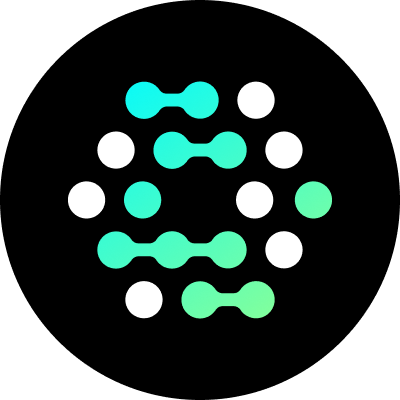

<div align="center">
  <p><a href="https://tempestphp.com"></a></p>

  <h1>OpenFGA PHP SDK</h1>

  <p>
    <a href="https://codecov.io/gh/evansims/openfga-php" target="_blank"></a>
    <a href="https://shepherd.dev/github/evansims/openfga-php" target="_blank"></a>
    <a href="https://www.bestpractices.dev/projects/10666"></a>
  </p>

  <p>Stop writing authorization logic. Start asking questions.</p>

  <p><code>composer require evansims/openfga-php</code></p>
</div>

<p><br /></p>

**Every app needs permissions.** Most developers end up with authorization logic scattered across controllers, middleware, and business logic. Changes break things. New features require touching dozens of files.

**[OpenFGA](https://openfga.dev/) solves this.** Define your authorization rules once, query them anywhere. This SDK provides a modern PHP interface to [OpenFGA](https://openfga.dev/) and [Auth0 FGA](https://auth0.com/fine-grained-authorization).

<br />

<details>
<summary><strong>Table of Contents</strong></summary>

- [Installation](#installation)
- [Quickstart](#quickstart)
- [Highlights](#highlights)
- [Learn more](#learn-more)
- [Contributing](#contributing)

</details>

<p><br /></p>

## Installation

```bash
composer require evansims/openfga-php
```

<p><br /></p>

## Quickstart

```php
use OpenFGA\Client;
use function OpenFGA\{allowed, tuple};

$client = new Client(url: 'http://localhost:8080');

// Instead of scattered if statements in your controllers:
if ($user->isAdmin() || $user->owns($document) || $user->team->canEdit($document)) {
    // ...
}

// Ask OpenFGA:
$canEdit = allowed(
    client: $client,
    store: 'my-store',
    model: 'my-model',
    tuple: tuple('user:alice', 'editor', 'document:readme')
);

// Zero business logic coupling. Pure authorization.
```

See [the documentation](docs/README.md) to get started.

<p><br /></p>

## Highlights

- **Zero business logic coupling** — Authorization stays separate from your domain code
- **Scalable architecture** — Battle-tested relationship-based access control patterns inspired by Google Zanzibar
- **Type-safe by design** — Complete type hints, strict typing, and full IDE support
- **Human-readable DSL** — Define authorization models with intuitive syntax
- **Production ready** — OpenTelemetry observability, retry logic, and circuit breakers included
- **Developer experience first** — Stewarded by 30+ years of PHP expertise with intuitive APIs and comprehensive documentation

<p><br /></p>

## Learn more

Ready to build bulletproof authorization? See [the documentation](docs/README.md) for:

**Getting Started**<br />
Build your authorization integration

- [Introduction](https://github.com/evansims/openfga-php/wiki/Introduction)<br />
  Start here to get your first authorization check working.
- [Installation](https://github.com/evansims/openfga-php/wiki/Introduction#install-the-sdk)<br />
  Install the SDK and set up your first authorization store.
- [Authentication](https://github.com/evansims/openfga-php/wiki/Authentication)<br />
  Set up authentication for production environments and managed services.

**Essentials**<br />
Learn the core concepts and patterns

- [Stores](https://github.com/evansims/openfga-php/wiki/Stores)<br />
  Manage authorization stores for multi-tenant applications and environment separation.
- [Authorization Models](https://github.com/evansims/openfga-php/wiki/Models)<br />
  Learn how to define your permission rules using OpenFGA's intuitive DSL.
- [Relationship Tuples](https://github.com/evansims/openfga-php/wiki/Tuples)<br />
  Understand how to grant and revoke specific permissions between users and resources.
- [Permission Queries](https://github.com/evansims/openfga-php/wiki/Queries)<br />
  Master the four types of queries: check permissions, list objects, find users, and expand relationships.
- [Assertions](https://github.com/evansims/openfga-php/wiki/Assertions)<br />
  Define test cases to verify your authorization model.

**Features**<br />
Explore advanced features and patterns

- [Concurrency](https://github.com/evansims/openfga-php/wiki/Concurrency)<br />
  Leveraging the SDK's powerful concurrency features to improve performance when working with large-scale authorization operations.
- [Exceptions](https://github.com/evansims/openfga-php/wiki/Exceptions)<br />
  Handling errors and exceptions in your authorization system.
- [Integration](https://github.com/evansims/openfga-php/wiki/Integration)<br />
  Integrating OpenFGA with your existing systems and frameworks.
- [Observability](https://github.com/evansims/openfga-php/wiki/Observability)<br />
  Comprehensive tracing and metrics to monitor your authorization system.
- [Results](https://github.com/evansims/openfga-php/wiki/Results)<br />
  Building robust applications with proper response handling using the SDK's Result pattern.

<p><br /></p>

## Contributing

Contributions are welcome — have a look at our [contributing guidelines](.github/CONTRIBUTING.md).
